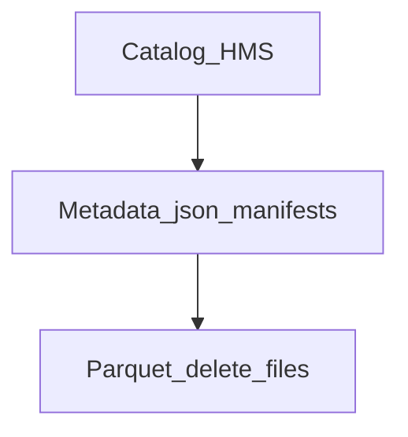

# Iceberg 3계층 아키텍처

1. **Catalog** — Hive Metastore에 테이블 이름·Iceberg 메타데이터 파일 위치
2. **Metadata** — `metadata.json`, manifest list, manifest (스냅샷, 스키마, 파티션)
3. **Data** — Parquet 데이터 파일, (V2) delete files

쓰기 시 새 snapshot이 commit되고 metadata.json이 전환됩니다.
