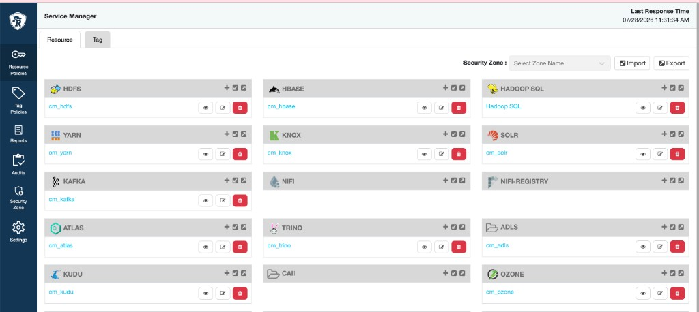

# Ozone + Iceberg

Iceberg Lab은 테이블 데이터·메타데이터를 **Ozone** 위 `ofs://` 경로(warehouse)에 둡니다.  
Lab을 시작하기 **전에** Ozone **volume**과 **bucket**이 있어야 하며, Lab 계정에 **읽기/쓰기 권한**이 있어야 합니다.

| `.env` 변수 | 의미 | 예시 |
|-------------|------|------|
| `OZONE_SERVICE_ID` | 클러스터 Ozone 서비스 ID | `ozone1784520717` |
| `OZONE_VOLUME` | volume 이름 | `vol1` |
| `OZONE_BUCKET` | bucket 이름 | `bucket1` |
| `WAREHOUSE_OFS` | Iceberg warehouse 전체 URI | `ofs://ozone1784520717/vol1/bucket1/warehouse` |

설정 템플릿: [`config/core-site.xml`](../config/core-site.xml), [`config/spark-defaults.conf`](../config/spark-defaults.conf)

**목차:** [개념](#volumebucket이-뭔가요-초급) · [0 준비](#0-준비-edge-노드) · [1 CLI 생성](#1-volumebucket-생성-cli--권장) · [2 CM UI](#2-cloudera-manager--ozone-manager-ui-선택) · [**3 Ranger (Ozone)**](#3-apache-ranger-ozone-정책-cdp-필수에-가깝게) · [4 .env](#4-env와-sparkhive-설정-맞추기) · [5 스크립트](#5-자동-확인생성-스크립트-edge) · [6 오류](#6-자주-나는-오류) · [7 Lab](#7-lab과의-연결)

---

## Volume·Bucket이 뭔가요? (초급)

Ozone은 객체 스토리지입니다. HDFS처럼 “큰 디렉터리 하나”가 아니라 계층이 있습니다.

```text
Ozone Service (ID: ozone1784520717)
 └── Volume (vol1)          ← 테넌트·프로젝트 단위 구역
      └── Bucket (bucket1)  ← 그 안의 “버킷” (S3 bucket과 비슷한 개념)
           └── warehouse/    ← 이 Lab이 쓰는 접두(prefix). Iceberg 테이블 파일이 그 아래 생성됨
```

- **있지만 권한이 없으면** `CREATE TABLE`, `INSERT`, `hdfs dfs -put` 등이 **Permission denied** 또는 **RangerAudit** 거부로 실패합니다.
- CDP에서 **Ranger가 켜져 있으면** Ozone ACL만으로는 부족하고, **Ranger의 Ozone 서비스(`cm_ozone`) 정책**이 허용해야 합니다. → [3. Ranger](#3-apache-ranger-ozone-정책-cdp-필수에-가깝게)

Lab 01부터 warehouse 하위에 Iceberg location이 생성됩니다. Lab 10에서 `DESCRIBE EXTENDED`로 location을 확인할 수 있습니다.

---

## 0. 준비 (edge 노드)

1. **Cloudera edge 노드**에 접속 (Ozone·HDFS 클라이언트, `ozone`, `hdfs`, `kinit` 사용 가능한 호스트).
2. 프로젝트 `.env` 설정 (또는 최소한 volume/bucket 이름을 아래 예시와 **동일하게** 맞출 것).

   ```bash
   cp .env.example .env
   # OZONE_* , WAREHOUSE_OFS 를 만들 volume/bucket 이름과 일치시킵니다.
   ```

3. **Kerberos** 로그인 (Lab과 같은 principal 권장):

   ```bash
   kinit -kt /cdep/keytabs/systest.keytab systest@QE-INFRA-AD.CLOUDERA.COM
   klist
   ```

4. **Service ID 확인** — `.env`의 `OZONE_SERVICE_ID`와 같아야 합니다.

   ```bash
   ozone getconf confKey ozone.service.id
   ```

   `core-site.xml`의 `ozone.service.id` / `fs.defaultFS`(ofs://…) 값과도 일치하는지 확인하세요.

---

## 1. Volume·Bucket 생성 (CLI — 권장)

아래에서는 `.env.example`과 같은 이름(`vol1`, `bucket1`)을 사용합니다. **다른 이름을 쓰면** `.env`와 `WAREHOUSE_OFS`를 함께 바꾸세요.

### 1-1. Volume 만들기

```bash
# 이미 있으면 info 가 성공합니다. 없으면 create 합니다.
ozone sh volume info vol1 2>/dev/null || ozone sh volume create vol1
ozone sh volume info vol1
```

### 1-2. Lab 사용자에게 volume 권한

Ozone 버전·클러스터 정책에 따라 `addacl` / `setacl` 중 하나를 씁니다. **관리자 계정**으로 실행하는 경우가 많습니다.

```bash
# 예: Lab Kerberos 사용자에게 read/write (REALM은 환경에 맞게 수정)
ozone sh volume addacl vol1 -u systest@QE-INFRA-AD.CLOUDERA.COM:rw
# 또는
# ozone sh volume setacl vol1 -u systest@QE-INFRA-AD.CLOUDERA.COM:rw
```

그룹 단위로 부여하는 경우:

```bash
ozone sh volume addacl vol1 -g lab-users:rw
```

### 1-3. Bucket 만들기

```bash
ozone sh bucket info vol1/bucket1 2>/dev/null || ozone sh bucket create vol1/bucket1
ozone sh bucket info vol1/bucket1
```

일부 환경에서는 bucket 경로 표기가 `/vol1/bucket1` 형태를 요구합니다. `ozone sh bucket create --help`로 클러스터 문법을 확인하세요.

### 1-4. Bucket 권한

```bash
ozone sh bucket addacl vol1/bucket1 -u systest@QE-INFRA-AD.CLOUDERA.COM:rw
```

### 1-5. warehouse 디렉터리(prefix) 만들기

Bucket만 만들어지고 **warehouse 폴더는 자동으로 생기지 않습니다.** Iceberg warehouse 경로를 미리 만듭니다.

```bash
hdfs dfs -mkdir -p ofs://ozone1784520717/vol1/bucket1/warehouse
hdfs dfs -ls ofs://ozone1784520717/vol1/bucket1/
```

`OZONE_SERVICE_ID`가 다르면 URI의 `ozone1784520717` 부분을 바꿉니다.

### 1-6. Lab 계정으로 쓰기 테스트

```bash
kinit -kt /cdep/keytabs/systest.keytab systest@QE-INFRA-AD.CLOUDERA.COM
echo ok | hdfs dfs -put - ofs://ozone1784520717/vol1/bucket1/warehouse/_write_test.txt
hdfs dfs -cat ofs://ozone1784520717/vol1/bucket1/warehouse/_write_test.txt
hdfs dfs -rm ofs://ozone1784520717/vol1/bucket1/warehouse/_write_test.txt
```

여기까지 성공하면 Lab 01의 `CREATE TABLE` / `INSERT`가 같은 경로를 쓸 준비가 된 것입니다.

---

## 2. Cloudera Manager / Ozone Manager UI (선택)

CLI 대신 UI를 쓰는 클러스터도 있습니다. 메뉴 이름은 CDP 버전마다 조금 다릅니다.

1. **Cloudera Manager** → **Ozone** (또는 **Ozone Manager / Recon**) 서비스로 이동.
2. **Volumes** → **Create Volume** → 이름 `vol1` (또는 `.env`의 `OZONE_VOLUME`).
3. Volume ACL/Quota에서 Lab 사용자·그룹에 **READ, WRITE** (및 필요 시 CREATE) 부여.
4. **Buckets** → 해당 volume 아래 **Create Bucket** → `bucket1`.
5. Bucket ACL도 동일 principal/그룹에 **READ, WRITE** 부여.
6. edge에서 **1-5 warehouse mkdir** 및 **1-6 쓰기 테스트**는 UI만으로 대체되지 않으므로 CLI로 한 번 실행하는 것을 권장합니다.

UI로 volume/bucket을 만든 뒤에는 **Ranger Ozone 정책**을 반드시 추가하세요 ([3장](#3-apache-ranger-ozone-정책-cdp-필수에-가깝게)).

---

## 3. Apache Ranger — Ozone 정책 (CDP, **필수에 가깝게**)

Cloudera CDP에서는 **Apache Ranger**가 Ozone 접근을 **최종 허용/거부**합니다. Volume·bucket을 만들고 Ozone ACL을 줘도, Ranger에 정책이 없으면 Lab 계정은 `ofs://` 에 쓸 수 없습니다.

### 3-1. Ranger UI 들어가기

1. **Cloudera Manager** → **Ozone** 또는 **Ranger** 서비스 → **Ranger Admin UI** 링크  
   (또는 조직에서 안내하는 Knox/Ranger URL)
2. 왼쪽 **Service Manager** (또는 상단 **Settings → Service Manager**) 로 이동합니다.
3. **Resource** 탭이 선택되어 있는지 확인합니다.

서비스 목록에서 **OZONE** 행을 찾습니다. CDP에서 이름은 보통 **`cm_ozone`** 입니다.



- **`cm_ozone` 옆 `+` (Add New Policy)** — 새 Ozone 정책 추가
- **연필 아이콘** — 서비스 정의 편집 (일반 Lab 사용자는 건드리지 않음)
- **눈 아이콘** — 기존 정책 목록 보기

**Security Zone** 드롭다운을 쓰는 클러스터면, volume/bucket이 속한 Zone을 선택한 뒤 정책을 추가해야 적용됩니다.

### 3-2. Lab에 필요한 권한 (개념)

Iceberg Lab(`systest` 등)이 warehouse 아래에 **디렉터리·Parquet·메타데이터 JSON**을 만들고, compaction·expire 시 **삭제**까지 하려면 대략 다음이 필요합니다.

| Ranger access type (표기는 UI마다 약간 다름) | Lab에서 쓰이는 경우 |
|---------------------------------------------|---------------------|
| **Read** | 파일·메타 읽기, SELECT |
| **Write** | 파일 덮어쓰기, commit |
| **Create** | 새 key(경로) 생성, INSERT, `mkdir` |
| **Delete** | 파일 삭제, maintenance |
| **List** | bucket/prefix 목록, planner |

운영 환경에서는 `warehouse/*` prefix만 좁히는 것을 권장합니다. **학습용 Lab**에서는 bucket 전체(`key` = `*`)로 두는 팀도 있으나, 보안팀 정책에 맞게 조정하세요.

### 3-3. 정책 예시 A — warehouse prefix만 (권장)

**Add New Policy** → Ozone 서비스 `cm_ozone`:

| 항목 | 값 (예시 — `.env`와 동일하게) |
|------|-------------------------------|
| **Policy Name** | `iceberg-lab-warehouse-vol1-bucket1` |
| **Policy Label** | (비워도 됨) |
| **Description** | Iceberg complete lab — ofs warehouse |
| **Audit Logging** | 켜기 (거부 시 원인 추적) |

**Resources** (Ozone plugin 필드 이름은 CDP 7.3.x 기준; 화면에 `volume` / `bucket` / `key` 가 보입니다):

| Resource | Value | Include |
|----------|-------|---------|
| **volume** | `vol1` | ✓ |
| **bucket** | `bucket1` | ✓ |
| **key** | `warehouse` 또는 `warehouse/*` | ✓ |

- UI가 **key를 prefix**로 해석하면 `warehouse` 만으로 하위 전체가 포함되는 경우가 많습니다.
- **Exclude** 는 비웁니다.

**Policy Conditions** — 특별한 IP/시간 조건이 없으면 비웁니다.

**Allow** 섹션:

| Users | Groups | Permissions |
|-------|--------|-------------|
| `systest` | (선택) Lab용 AD/LDAP 그룹 | **Read, Write, Create, Delete, List** (UI에 **All** 이 있으면 Lab 전용 정책에만 사용) |

Kerberos principal은 Ranger에 **`systest`** (짧은 이름) 또는 **`systest@QE-INFRA-AD.CLOUDERA.COM`** 형태로 등록되어 있을 수 있습니다.  
**거부되면** Ranger **Audits**에서 “requested user” 문자열을 보고 Users 필드와 **완전히 동일하게** 맞춥니다.

**Deny** — 비웁니다.

**Save** 후 1~2분 내 클러스터에 배포됩니다. (Ranger policy cache)

### 3-4. 정책 예시 B — bucket 생성·목록 (volume 수준)

`ozone sh bucket create` 는 **관리자**가 하고, Lab 사용자는 **이미 있는 bucket**만 쓰는 경우가 많습니다.  
그래도 **volume 목록·bucket 메타** 접근에서 막히면 아래 **추가** 정책을 검토합니다.

| Policy Name | Resources | Allow |
|-------------|-----------|-------|
| `iceberg-lab-volume-vol1-list` | volume=`vol1`, bucket=`*`, key=`*` | Users: `systest`, Permissions: **Read, List** (필요 시 **Create** — bucket 하위 key 생성) |

bucket **`bucket1` 전체**에 Lab 쓰기를 허용하는 단순 정책:

| Policy Name | Resources | Allow |
|-------------|-----------|-------|
| `iceberg-lab-bucket-vol1-bucket1` | volume=`vol1`, bucket=`bucket1`, key=`*` | Read, Write, Create, Delete, List |

**A(warehouse prefix) + B(volume list)** 조합이 실무에서 흔합니다.  
팀 정책이 “bucket 하나에 All” 을 허용하면 A만으로 충분할 수 있습니다.

### 3-5. 적용 확인

1. edge에서 Lab principal로 `kinit`
2. [1-6 쓰기 테스트](#1-6-lab-계정으로-쓰기-테스트) 재실행
3. 실패 시 **Ranger → Audits**:
   - Service: **cm_ozone**
   - Access: **denied**
   - Resource: volume/bucket/key 와 **요청 user** 확인 → 정책 Users·Resources·Permissions 수정

```bash
./scripts/setup_ozone_storage.sh --check
./scripts/validate.sh
```

### 3-6. Ozone 말고 Lab에 자주 필요한 Ranger (참고)

Service Manager 스크린샷에 같이 보이는 서비스 중, Iceberg Lab **전체**와 연관되는 것:

| 서비스 (예시 이름) | 용도 |
|--------------------|------|
| **HADOOP SQL** | HiveServer2 / `iceberg_lab` DB 테이블·UDF (Spark가 Hive catalog 쓸 때) |
| **HDFS** | warehouse가 HDFS인 경우 (본 Lab은 **Ozone ofs** 위주) |
| **HBASE** | (본 Lab 필수 아님) |

Ozone warehouse만 Ranger에서 열어도 **Hive/Impala 메타**는 HMS/Ranger Hadoop SQL 정책이 별도일 수 있습니다.  
DB/테이블 거부는 [`troubleshooting.md`](troubleshooting.md)와 Hive Ranger 정책을 함께 보세요.

**Lab 11** ([`labs/lab-11-security`](../labs/lab-11-security/README.md))은 Kerberos 연결 확인; **Ranger Ozone**은 이 장에서 Lab 01 **이전**에 맞춰 두는 것이 좋습니다.

---

## 4. `.env`와 Spark/Hive 설정 맞추기

volume/bucket 이름을 `myvol` / `mybucket`으로 만들었다면:

```bash
OZONE_VOLUME=myvol
OZONE_BUCKET=mybucket
WAREHOUSE_OFS=ofs://${OZONE_SERVICE_ID}/myvol/mybucket/warehouse
```

`WAREHOUSE_OFS`는 **반드시** `ofs://<serviceId>/<volume>/<bucket>/warehouse` 형태가 되게 합니다.

로컬 템플릿을 클러스터에 반영할 때:

- [`config/spark-defaults.conf`](../config/spark-defaults.conf)의 `spark.sql.catalog.hive_prod.warehouse`
- Hive/Impala의 warehouse 또는 Iceberg location 관련 설정

이 **같은 URI**를 가리키는지 확인하세요.

---

## 5. 자동 확인·생성 스크립트 (edge)

프로젝트 루트에서 (Kerberos 이후):

```bash
# 상태만 확인 (없으면 가이드 링크 출력)
./scripts/setup_ozone_storage.sh --check

# volume/bucket/warehouse 생성 시도 (Ozone ACL은 관리자 권한 필요할 수 있음)
./scripts/setup_ozone_storage.sh --apply
```

`--apply`는 **이미 존재하는 리소스는 건너뛰고**, 없을 때만 `ozone sh volume create` / `bucket create` / `hdfs dfs -mkdir` 를 호출합니다.  
**Ranger가 활성화된 CDP**에서는 생성 후 반드시 [3. Ranger Ozone 정책](#3-apache-ranger-ozone-정책-cdp-필수에-가깝게)을 추가하세요. Ozone ACL(1-2, 1-4)은 클러스터에 따라 추가로 필요할 수 있습니다.

전체 환경 검증:

```bash
./scripts/validate.sh
```

warehouse 경로가 없으면 `[WARN]`으로 `docs/04-ozone-storage.md`를 안내합니다.

---

## 6. 자주 나는 오류

| 증상 | 확인할 것 |
|------|-----------|
| `Volume not found` | volume create, 이름과 `.env` `OZONE_VOLUME` 일치 |
| `Bucket not found` | bucket create, `vol/bucket` 조합 |
| `Access denied` / Ranger | **Ranger Audits** (`cm_ozone`) → [3장](#3-apache-ranger-ozone-정책-cdp-필수에-가깝게) 정책·user 이름·key prefix; Ozone ACL |
| `Wrong FS` / ofs URI 오류 | `OZONE_SERVICE_ID`, `fs.ofs.impl` (RootedOzoneFileSystem) |
| Hive/Spark warehouse 불일치 | `.env` `WAREHOUSE_OFS`와 catalog warehouse 동일 URI |

더 많은 항목: [`troubleshooting.md`](troubleshooting.md)

---

## 7. Lab과의 연결

| Lab | Ozone 관련 |
|-----|------------|
| 01~09 | warehouse 아래 Iceberg 테이블 생성·쓰기 |
| 10 | `DESCRIBE` / `COUNT`로 `ofs://` location 확인 |

**권장 순서:** volume·bucket·warehouse 준비 (1장) → **Ranger Ozone 정책** (3장) → `./scripts/validate.sh` → Lab 01.
